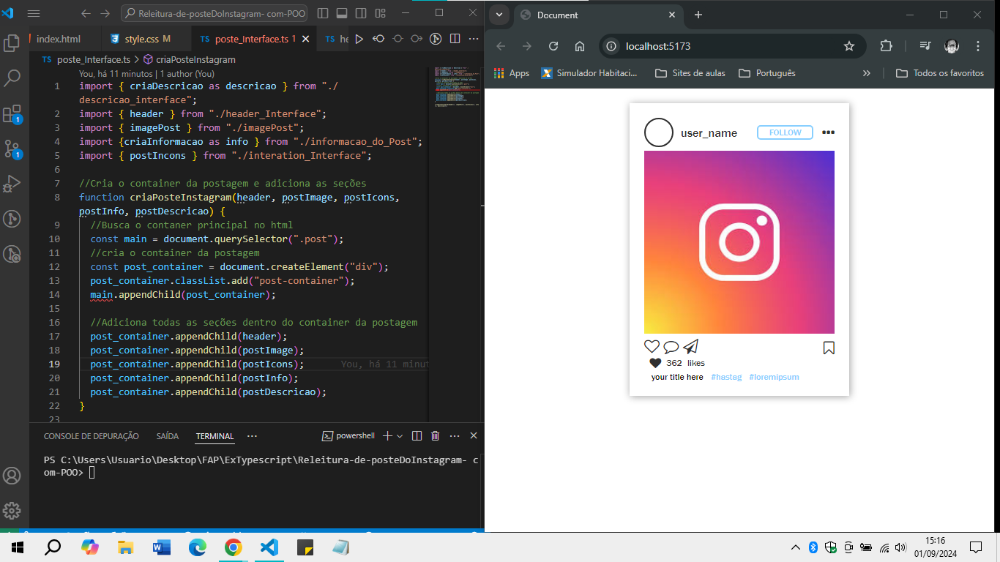

# Releitura de postagens do Instagram

## Esse é um projeto proposto em sala no programa de formação acelerada do Softex Pernambuco.

Todo o html da postagem foi feito com typescript. 
Fazendo com que a estrututa se tornasse dinâmica. 
Permitindo assim, com mais eficiência, a interação com servidores e banco de dados. 

